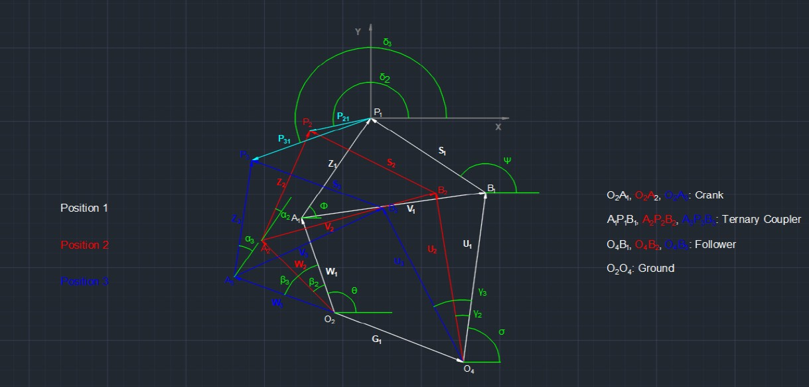

# Kinematic Synthesis of Aircraft Flap Actuation Mechanism


## Overview
This repository contains the **mathematical implementation and validation** of a kinematic synthesis technique, namely **Three Position Synthesis** for the outboard single slotted fowler flap mechanism used in aircraft, developed during my internship at **CSIR-National Aerospace Laboratories (CSIR-NAL)** from May to July 2025.

This project focused on understanding the governing theory of **Three-Position Synthesis** for four-bar linkages, implementing these derivations in MATLAB, and applying the solver to determine the link lengths of a real-world **Boeing 777** outboard flap mechanism.

<h2 align="center">Mechanism Analysis & Simulation</h2>

<p align="center">
  
  <br>
  <em>Figure 1: Kinematic simulation of the syntesised flap mechanism, visualized using MotionGen</em>
</p>

<div align="center">
  <table>
    <tr>
      <td align="center">
        
        <br>
        <strong>Derivation Model (Vector Loop) sketched in AutoCAD</strong>
      </td>
      <td align="center">
        
        <br>
        <strong>Validation Model, sketched in AutoCAD</strong>
      </td>
    </tr>
  </table>
</div>

## Key Objectives
* *Mathematical Derivation:* Derived the loop-closure equations for three-position synthesis of four-bar linkages.
* *Algorithmic Implementation:* Developed a MATLAB solver to automate the synthesis process, taking three points which the coupler link passes through and outputting the required link lengths.
* *Validation:* Verified the code against standard textbook examples to ensure numerical accuracy.
* *Real-world Application:* Applied the validated algorithm to reverse-calculate the dimensions of a **Boeing 777** single slotted fowler flap mechanism.

## Methodology
The project followed a systematic "Theory-to-Application" workflow:

1.  *Theoretical Framework:* Studied the rigid body guidance problem and derived the analytical synthesis equations for a 4-bar mechanism.
2.  *Code Development:* Wrote modular MATLAB scripts to solve the resulting linear system of equations.
3.  *Benchmarking:* Validated the solver using a known textbook problem to confirm that the computed link lengths matched the expected values.
4.  *Case Study for Boeing 777 Flap:*
    * *Input:* Extracted the three points that the coupler link (attached to the flap airfoil) passes through during opration (stowed, take-off, landing).
    * *Process:* Fed these positions into the MATLAB solver.
    * *Output:* Successfully obtained the correct geometric link lengths (<4mm error) for the actuation mechanism.

## Repository Structure
```text
aircraft-flap-mechanism-synthesis/
│
├── src/                        # MATLAB live scripts
│   ├── validate_code.mlx       # To validate the derived kinematic equations
│   ├── B777_code.mlx           # MATLAB solver that computes link lenghts of outboard B777 single slotted fowler flap
|
├── docs/                       
│   ├── Project_Report.pdf      # Project documentation
│
├── assets/                     # Images and animations for the README
│   ├── gif_mech.gif
│   ├── ss_derive.png
│   └── ss_validate.png
│
└── README.md                   # Project overview
